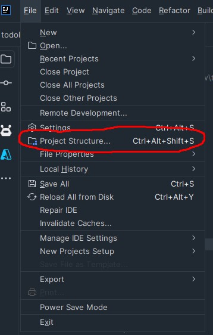
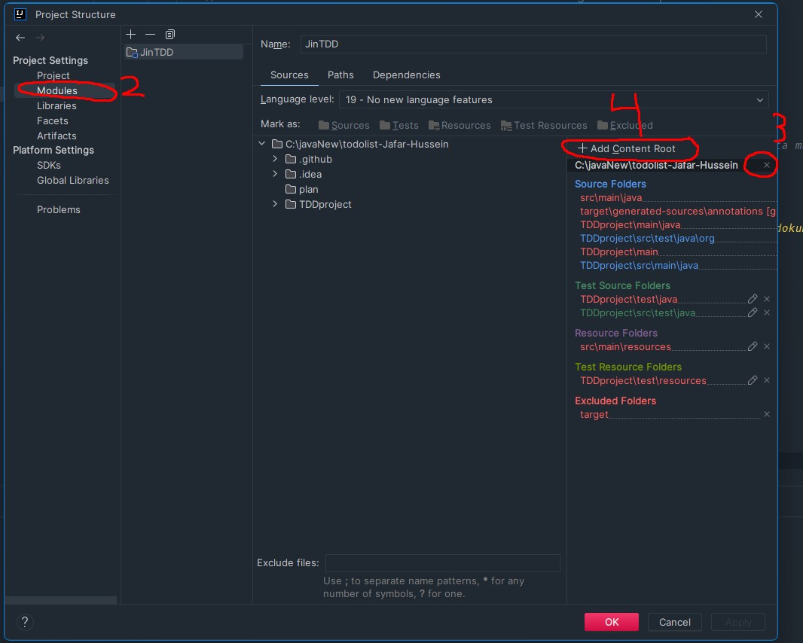
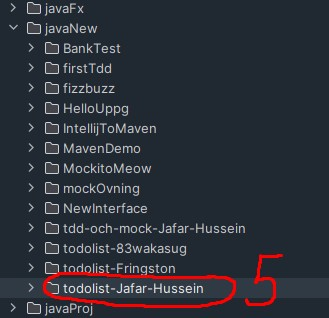

# När man klonar repo
## Om du har problem med att starta projektet gör så här
## Steg 1

+ gå längst upp åt vänstra hörnet
+ tryck på file 
+ tryck på project structure

## Steg 2

+ tryck på modules
+ tryck på plus
+ om du inte saknar content root och projektet fungerar fortfarande inte, följ steg 2, 3, 4 behövs ta bort sen läggas till igen.
+ om du inte har content root, add content root, tryck på plus, välj fil med samma namn som projektet

+ välj filen med samma namn som projektet